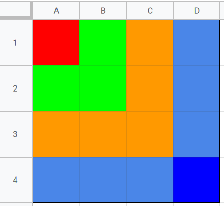

# Dynamic Programming | Number Tower
# [LC-1301 : Number of Paths with Max Score](https://leetcode.com/problems/number-of-paths-with-max-score/)

## Approach
Top down DP.
If we have four cells like this:
+---+---+
| O | A |
+---+---+
| B | C |
+---+---+
Then,
```
DP(O) = maximum pathsum from {DP(A), DP(B), DP(C)} + int(grid[O])
```

If we have a figure to show the high level layer by layer exploration process, the figure will be something like this. 
Then it is clear from this vis that the complexity of this algorithm is `O(RC)` or `O(mn)`. 
In the real exploration process, it will not explore exactly this way, instead it will follow a DFS approach as shown later.



### ___Relationship between Recursion and DP___ -- ___Relationship between Recursion and DFS___
If we want to explore the bottom up DP process, we can print out i, j based on above code by using this test case:
```
["E111","1111","1111","111S"]
```

We will have the following output:
```
step  0 :  0 0
step  1 :  1 0
step  2 :  2 0
step  3 :  3 0
step  4 :  3 1
step  5 :  3 2
step  6 :  3 3
step  7 :  2 1
step  8 :  2 2
step  9 :  2 3
step 10 :  1 1
step 11 :  1 2
step 12 :  1 3
step 13 :  0 1
step 14 :  0 2
step 15 :  0 3
```

The exploration order can be explained by the following:
```
In order to solve dp(0, 0), we need dp(1,0), dp(0,1) and dp(1, 1).
in order to get dp(1,0), we need dp(2,0), dp(1,1) and dp(2,1)
in order to get dp(2,0), we need dp(3,0), dp(2,1) and dp(3,1)
in order to get dp(3,0), we need dp(3,1)
in order to get dp(3,1), we need dp(3,2)
in order to get dp(3,2), we need dp(3,3)
since we touch the bottom, we go back to solve dp(2,1)
in order to get dp(2,1), we need dp(3,1), dp(2,2), dp(3,2). As only dp(2,2) is not done, we need solve
dp(2,2) based on dp(3,2), dp(2,3), dp(3,3). As only dp(2,3) is not done, we need solve
dp(2,3) based on dp(3,3). dp(3,3) is already solved, we went back to
dp(1,1)
...
```

From this example, I hope that we can have a deeper understanding about:

  * ___relationship between recursion and DP___
  * ___relationship between recursion and DFS___

### 1. Memoization (Top-Down)
Time complexity: `O(N^2)`
Space complexity: `O(N^2)`
---
#### Python Solution
---
```python
from functools import lru_cache
class Solution:
    def pathsWithMaxScore(self, grid: List[str]) -> List[int]:
	    MOD = 10**9+7
        grid[0] = "0"+grid[0][1:]
        R, C = len(grid), len(grid[0])
        self.reachable = False
        @lru_cache(None)
        def dp(i, j):
            if i==R-1 and j==C-1:
                self.reachable=True
                return [0, 1]
            substates = [(i+1,j), (i,j+1),(i+1,j+1)]
            valid_substates = [[r,c] for r, c in substates if 0<=r<R and 0<=c<C and grid[r][c]!='X']
            if not valid_substates:return [0, 0]
            results = [dp(r, c) for r,c in valid_substates]
            max_path_sum, _ = max(results)
            path_cnt = sum(this_path_cnt for this_path_sum, this_path_cnt in results if this_path_sum==max_path_sum)
            return [max_path_sum+int(grid[i][j]), path_cnt%MOD]
        
        res = dp(0, 0)
        return res if self.reachable else [0,0]
		
    def pathsWithMaxScore(self, board: List[str]) -> List[int]:
        n,coord=len(board)-1,[(0,-1),(-1,0),(-1,-1)]
        
        @lru_cache(None)
        def get_max(i,j):
            if i<0 or j<0: return -float('inf')
            if board[i][j]=='X': return -float('inf')
            if board[i][j]=='E': return 0
            if board[i][j]=='S': return max(get_max(i+x,j+y) for x,y in coord)
            return max(get_max(i+x,j+y) for x,y in coord)+int(board[i][j])
        
        total=(get_max(n,n))
        
        if total<0: return (0,0)
        
        @lru_cache(None)
        def get_path(total,i,j):
            if i<0 or j<0: return 0
            if board[i][j]=='X': return 0
            if board[i][j]=='E': return 1 if total==0 else 0
            if board[i][j]=='S': return sum(get_path(total,i+x,j+y) for x,y in coord)
            if total==get_max(i,j): return sum(get_path(total-int(board[i][j]),i+x,j+y)  for x,y in coord)
            return 0
        
        paths=get_path(total,n,n)%(10**9+7)
        
        return [total,paths]		
```
---
#### Java Solution
---
```
import org.junit.Test;

import java.util.Arrays;
import java.util.List;

import static org.junit.Assert.assertArrayEquals;

public class Solution {
    int MOD = 1000000007;
    public int[] pathsWithMaxScore(List<String> board) {
        int i = board.size();
        int j = board.get(0).length();
        
        int[][][] dp = new int[i][j][2];
        boolean[][] visited = new boolean[i][j];
        
        dp[i-1][j-1][1] = 1;
        visited[i-1][j-1] = true;
        
        return helper(dp, board, 0, 0, visited);
    }
    
    private int[] helper(int[][][] dp, List<String> board, int i, int j, boolean[][] visited) {
        int[] r = new int[2];
        
        if (i < 0 || j < 0 || i >= dp.length || j >= dp[0].length || 
           board.get(i).charAt(j) == 'X')
            return r;
        
        if (visited[i][j])
            return dp[i][j];
        
        int[] a1 = helper(dp, board, i+1, j, visited);
        int[] a2 = helper(dp, board, i+1, j+1, visited);
        int[] a3 = helper(dp, board, i, j+1, visited);
        
        r[0] = Math.max(Math.max(a1[0], a2[0]), a3[0]);
        if (a1[0] == r[0]) r[1] = (r[1]+ a1[1]) % MOD;
        if (a2[0] == r[0]) r[1] = (r[1]+ a2[1]) % MOD;
        if (a3[0] == r[0]) r[1] = (r[1]+ a3[1]) % MOD;
        
        if (board.get(i).charAt(j) != 'E' && r[1] != 0)
            r[0] = (r[0] + (board.get(i).charAt(j) - '0')) % MOD;
        
        dp[i][j] = r;
        visited[i][j] = true;
        
        return r;
            
    }

    @Test
    public void test() {
        assertArrayEquals(new int[]{34, 3}, new Solution().pathsWithMaxScore(Arrays.asList("E11345","X452XX","3X43X4","422812","284522","13422S")));
        assertArrayEquals(new int[]{7, 1}, new Solution().pathsWithMaxScore(Arrays.asList("E23","2X2","12S")));
        assertArrayEquals(new int[]{4, 2}, new Solution().pathsWithMaxScore(Arrays.asList("E12","1X1","21S")));
        assertArrayEquals(new int[]{0, 0}, new Solution().pathsWithMaxScore(Arrays.asList("E11","XXX","11S")));
    }	
}
```
### 2. Tabulation (Bottom-Up)
Time complexity: `O(N^2)`
Space complexity: `O(N^2)`

**Python O(n^2) sol. by 2D dynamic programming.**

#### Goal:

  1. Find the path with highest score (i.e., optimal path)
  2. Compute the number of optimal paths.

#### Algorithm:
Update table from start point to destination by 2D dynamic programming, with optimal substructure described as below.

#### Optimal substructure:

**Notation:**
```
Score[ i ][ j ] as the highest score from start point to gird [ i ][ j ].
Count_of_path[ i ][ j ] as the number of optimal paths

Score[ i ][ j ] = Board[ i ][ j ] + max( Score[ i+1 ][ j ], Score[ i+1 ][ j+1 ], Score[ i ][ j+1 ] )
Count_of_path[ i ][ j ] = All of Count_of_path[ i' ][ j' ] where Score[ i' ][ j' ] makes optimal path
```
---
#### Python Solution
---
```python
from typing import List
class Solution:
    def pathsWithMaxScore(self, board: List[str]) -> List[int]:
        # modulo constant defined by description
        constant = int( 1e9 ) + 7
        
        # dimensions of board (# of rows and # of columns)
        rows = len(board)
        cols = len(board[0])
        
        # a table for highest score path with Dynamic Progrmming
        score = [ [ 0 for y in range(cols+1) ] for x in range(rows+1) ]
        
        # a talbe for counter of highest score path with Dynamic Progrmming
        count_of_path = [ [ 0 for y in range(cols+1) ] for x in range(rows+1) ]
        
        # Initialization for start point:
        # Let 
        # score = 0 ( completed in variable declaration )
        # path count = 1
        count_of_path[cols-1][rows-1] = 1
        
        unreachable = set()
        
        # Update table from start point to end point
        for y in range(cols-1, -1, -1):
            for x in range(rows-1, -1, -1):
                
                if (y, x) == (cols-1, rows-1):
                    # start point, table value has been initialized as above.
                    continue
                
                if board[y][x] != 'X' and (y,x) not in unreachable:
                    # find highest score path, excluding obstable
                    
                    # possible candidate:
                    # reach [y][x] from going up, going left, going up-left
                    highest_score = max( score[y+1][x], score[y+1][x+1], score[y][x+1] )
                    
                    if (y, x) == (0, 0):
                        # destination
                        score[y][x] += highest_score
                    else:
                        # in the middle of path finding, update score table
                        score[y][x] += highest_score + int(board[y][x])
                    
                    
                    optimal_count = 0
                    # update path counter with highest score path
                    if highest_score == score[y+1][x]:
                        optimal_count += count_of_path[y+1][x]
                        
                    if highest_score == score[y+1][x+1]:
                        optimal_count += count_of_path[y+1][x+1]
                        
                    if highest_score == score[y][x+1]:
                        optimal_count += count_of_path[y][x+1]
                    
                    count_of_path[y][x] = optimal_count % constant
                
                else:
                    
                    # mark those girds blocked by obstacle 'X' as unreachable
                    if (y,x) not in unreachable:
                        unreachable.add( (y,x) )
                        
                    if (y == cols-1 and x >= 1) or ( (y+1,x-1) in unreachable and (y+1,x) in unreachable ):
                        # block by the right hand side 'X' on the last row, or
                        # block by the ┘ shape,  three 'X's on the bottom right
                        unreachable.add( (y,x-1) )
                        
            
        if count_of_path[0][0] == 0:
            # destination is out of reach
            return [0, 0]
        else:
            # destination is reachable
            return [score[0][0], count_of_path[0][0] ]
```

---
#### Java Solution
---
```java
import org.junit.Test;

import java.util.Arrays;
import java.util.List;

import static org.junit.Assert.assertArrayEquals;

public class Solution {
    //private static final int unit = 1000000007;
	private static final int unit = 1_000_000_007;
    public int[] pathsWithMaxScore(List<String> board) {
        int d = board.size();

        int[][][] statusArray = new int[d][d][3]; // max, number of unit, mod
        statusArray[d - 1][d - 1][2] = 1;

        for (int r = d - 1; r >= 0; r--) {
            for (int c = d - 1; c >= 0; c--) {
                char ch = board.get(r).charAt(c);

                if (ch == 'X') {
                    continue;
                }

                int currentNumber = ch == 'E' ? 0 : ch - '0';
                int[] status = statusArray[r][c];

                if (r + 1 <= d - 1) {
                    check(status, currentNumber, statusArray[r + 1][c]);

                    if (c + 1 <= d - 1) {
                        check(status, currentNumber, statusArray[r + 1][c + 1]);
                    }
                } 
                
                if (c + 1 <= d - 1) {
                    check(status, currentNumber, statusArray[r][c + 1]);
                }
                
            }
        }

        return new int[]{statusArray[0][0][0], statusArray[0][0][2]};
    }

    private void check(int[] status, int currentNumber, int[] previousStatus) {
        if (previousStatus[1] == 0 && previousStatus[2] == 0) {
            return;
        }

        if (previousStatus[0] + currentNumber > status[0]) {
            status[0] = previousStatus[0] + currentNumber;
            status[1] = previousStatus[1];
            status[2] = previousStatus[2];
        } else if (previousStatus[0] + currentNumber == status[0]) {
            status[1] += previousStatus[1];
            
            if (unit - previousStatus[2] <= status[2]) {
                status[2] = status[2] - unit + previousStatus[2];
                status[1]++;
            } else {
                status[2] += previousStatus[2];
            }
        }
    }

    @Test
    public void test() {
        assertArrayEquals(new int[]{34, 3}, new Solution().pathsWithMaxScore(Arrays.asList("E11345","X452XX","3X43X4","422812","284522","13422S")));
        assertArrayEquals(new int[]{7, 1}, new Solution().pathsWithMaxScore(Arrays.asList("E23","2X2","12S")));
        assertArrayEquals(new int[]{4, 2}, new Solution().pathsWithMaxScore(Arrays.asList("E12","1X1","21S")));
        assertArrayEquals(new int[]{0, 0}, new Solution().pathsWithMaxScore(Arrays.asList("E11","XXX","11S")));
    }
}
```
---
#### JavaScript Solution
---
```JavaScript
/**
 * 
 * Synopsis:
 *
 * Start from the end E and go down-right until the start S (for me, it is more natural to start at 0,0 and end at N,N). Create two DP matrices, S for the sum, and P for path-count-per-sum. These matrices cells are offset by 1 compared to A's cells in order to build a recurrence relation upon themselves for a bottom-up solution. Thus S[i][j] is the maximum sum from A[0..i)[0..j) (note: both i and j are non-inclusive) and P[i][j] is the path count for the maximum sum from A[0..i)[0..j) (note: both i and j are non-inclusive).
 *
 * For each cell i,j find the maximum sum from adjacent cells u, v which are:
 *
 *   1. above-and-to-the-left
 *   2. above
 *   3. to-the-left
 *
 * The sum of the current i, j cell is found by adding the corresponding A value (which is offset by 1, and thus located at A[i - 1][j - 1]) to the previous adjacent cell's sum, ie. S[u][v] if a path exists to u,v. Otherwise if a path does not exist to u, v, then the sum is 0. There are 3 use-cases to consider for each sum calculated:
 *
 *   1. the sum coming from path u, v is less-than the current sum S[i][j]
 *   2. the sum coming from path u, v is equal-to the current sum S[i][j]
 *   3. the sum coming from path u, v is greater-than the current sum S[i][j]
 *
 *   - Case 1: irrelevant, since we only care about maximum sums and their path counts.
 *   - Case 2: the path count to i, j is incremented by the path count from u, v (modulus 1e9 + 7)
 *   - Case 3: a new max sum is found, store this max sum and set the path count to i, j to the path count from u, v
 *
 * Skip calculating the sum for cells which are blocked, ie. A[i - 1][j - 1] == 'X. Return the maximum sum S[N][N] and path count P[N][N] for A[0..N)[0..N).
 *
 * TC: O(N^2)
 * SC: O(N^2)
 *
 * Note: strings are immutable in javascript, so I added an additional check for the start/end (ie. S and E) when calculating the sum,
 * whereas in C++, I simply set A[0][0] = A[N - 1][N - 1] = 0.
 */
let pathsWithMaxScore = (A, dirs = [[-1,-1],[-1,0],[0,-1]], mod = 1e9 + 7) => {
    let N = A.length;
    let S = [...Array(N + 1)].map(row => Array(N + 1).fill(0)),
        P = [...Array(N + 1)].map(row => Array(N + 1).fill(0));
    P[0][0] = 1;
    for (let i = 1; i <= N; ++i) {
        for (let j = 1; j <= N; ++j) {
            if (A[i - 1][j - 1] == 'X')
                continue;
            for (let d of dirs) {
                let u = i + d[0],
                    v = j + d[1];
                let sum = !P[u][v] ? 0 : S[u][v] + (i == 1 && j == 1 ? 0 : i == N && j == N ? 0 : A[i - 1].charCodeAt(j - 1) - '0'.charCodeAt(0));
                if (S[i][j] == sum)
                    P[i][j] = (P[i][j] + P[u][v]) % mod;
                if (S[i][j] < sum)
                    S[i][j] = sum,
                    P[i][j] = P[u][v];
            }
        }
    }
    return [S[N][N], P[N][N]];
};
```
---
#### C++ Solution
---
```cpp
class Solution {
public:
    using VI = vector<int>;
    using VVI = vector<VI>;
    using VS = vector<string>;
    VI pathsWithMaxScore(VS& A, VVI dirs = {{-1,-1},{-1,0},{0,-1}}, int mod = 1e9 + 7) {
        int N = A.size();
        VVI S = VVI(N + 1, VI(N + 1)),
            P = VVI(N + 1, VI(N + 1));
        A[0][0] = A[N - 1][N - 1] = '0';
        P[0][0] = 1;
        for (auto i = 1; i <= N; ++i) {
            for (auto j = 1; j <= N; ++j) {
                if (A[i - 1][j - 1] == 'X')
                    continue;
                for (auto d: dirs) {
                    auto u = i + d[0],
                         v = j + d[1];
                    auto sum = !P[u][v] ? 0 : S[u][v] + (A[i - 1][j - 1] - '0');
                    if (S[i][j] == sum)
                        P[i][j] = (P[i][j] + P[u][v]) % mod;
                    if (S[i][j] < sum)
                        S[i][j] = sum,
                        P[i][j] = P[u][v];
                }
            }
        }
        return {S[N][N], P[N][N]};
    }
};
```